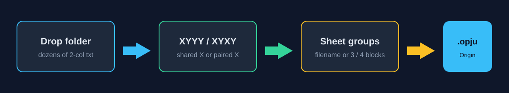

# Spectra to Origin

**Drop a folder of two-column XRD / spectroscopy txt files. Get one Origin Pro `.opju` — XYYY or XYXY already designated, curves already plotted.**

Stop walking Origin’s Import Wizard file by file. This small Windows tool talks to Origin Pro through `originpro`, writes one workbook, and fails out loud if Origin did not actually save the project.

<p align="center">
  
</p>

[English](#why-this-exists) · [中文](#为什么做这个工具)

---

## Why this exists

Origin can import ASCII. It is just slow when you have **dozens of 1D spectra**: comment headers, shared vs independent X, one sheet vs many, column designations, then plot. Scientists still do that click path every aging series, every temperature set, every scan folder.

This tool is the missing link:

| You have | Origin wants | This tool |
| --- | --- | --- |
| A pile of `2theta  intensity` txt | One worksheet, XYYY or XYXY | Infers layout from the X grid |
| A folder (and a `按温度` copy subfolder) | Unique curves, no duplicates | Folder / drop load, skip copies |
| Names like `01_400C_00.50h_…` | Separate graphs per condition | Filename groups, or split into 3 / 4 sheets by hand |
| Origin Pro on the machine | A real `.opju`, not “maybe it imported” | Writes `.opju` via COM; **no file → error**, never fake success |

It is intentionally small: two-column 1D spectra in, Origin project out. No fitting, no baseline, no interpolation.

---

## Features

- **Drop or add a folder** — Explorer drag-and-drop onto the window, or Add file / Add folder. Same load path.
- **Many txt in one shot** — dozens of spectra become one Origin book (tested at 48 files → 1 X + 48 Y, 48 line plots).
- **Auto XYYY / XYXY** — identical X columns → one X, many Y (`XYYY`). Different X → paired columns (`XYXY`). You can override. XYYY refuses mismatched X instead of silently interpolating.
- **Smart sheet groups** — repeating filename tokens (not only `400C`). If names are messy: even-split into 3 or 4 sheets, move selected curves, rename groups.
- **One `.opju`** — each group is one worksheet + one line graph, Long Name / Units / Comments filled, columns designated for plotting.
- **Visible Origin failure** — if Origin Pro is missing or save produced an empty file, the CLI returns 4 and prints `Origin 工程生成失败`. Optional xlsx/csv sidecar.

---

## Requirements

- Windows
- Python 3.10+ with `py -3` (avoid the Microsoft Store stub `python.exe`)
- `openpyxl` (`py -3 -m pip install -r requirements.txt`)
- **Origin Pro** (verified with Origin 2025) and the `originpro` / OriginExt bindings that ship with it

xlsx/csv export works without Origin (`--xlsx-only`). `.opju` does not.

---

## Run

```powershell
cd path\to\spectra-to-origin
py -3 -m pip install -r requirements.txt
.\run.bat
```

`run.bat` is ASCII-only on purpose so a folder under `桌面` does not smash `%~dp0`. `启动.bat` is the same launcher.

### GUI

1. Drop txt files or a folder onto the window (or click **添加文件** / **添加文件夹**).
2. Check the status line: X same → XYYY, X different → XYXY.
3. Keep filename groups, **均分成 3/4 张**, or **全部一张表**.
4. **生成 Origin 工程 (.opju)**.

If Origin is already open, confirm before continuing — the tool starts a new empty project in the bound Origin session.

### CLI (folder of many txt → one project)

```powershell
py -3 spectra_to_origin.py --cli -i "D:\data\spectra" -o "D:\out\series.opju" --layout auto
```

Useful flags:

| Flag | Meaning |
| --- | --- |
| `--layout auto\|XYYY\|XYXY` | Default `auto` |
| `--split-temp` | Filename auto-groups (not temperature-only) |
| `--n-groups N` | Consecutive even split into N sheets |
| `--also-xlsx` | Also write `.xlsx` / `.csv` |
| `--xlsx-only` | Tables only, do not start Origin |
| `--keep-open` | Leave Origin open after save |

---

## Layout rules

**XYYY** — first column X (`2theta`, deg), remaining columns Y (a.u.). Use when every file shares the same X grid (typical synchrotron 1D cake).

**XYXY** — `X1 Y1 X2 Y2 …`. Use when X axes differ. No resampling.

Comment lines starting with `#` are skipped. Metadata such as `eta=…; 400 C; 0.5 h` is copied into Origin Comments.

---

## Tests

```powershell
py -3 -m unittest -v
```

Coverage includes shared-X vs different-X inference, filename and manual grouping, folder drop + `按温度` dedupe, Tk drop-hook `update()` without ctypes overflow, Origin save failure visibility, and a 48-file CLI ingest that reopens the `.opju`.

---

## Limits

- Two-column numeric txt only.
- “Many” means dozens to low hundreds of spectra, not thousands of 4000-point files in one COM session.
- Does not fit peaks, subtract baselines, or offset-stack plots.
- Origin COM may attach to a running Origin; unsaved work in that session can be lost. The GUI warns; the CLI prints a warning.

---

## License

MIT. See [LICENSE](LICENSE).

---

## 为什么做这个工具

把一叠两列 1D 谱（2θ–强度）**一次**送进 Origin Pro：自动判断 XYYY / XYXY，按文件名或手动拆 sheet，写出真正的 `.opju`。不要再在 Import Wizard 里对每个 txt 点一遍。

### 怎么用

双击 `run.bat`，把文件夹拖进窗口，点 **生成 Origin 工程 (.opju)**。

命令行：

```powershell
py -3 spectra_to_origin.py --cli -i "谱线文件夹" -o "out.opju" --layout auto
```

X 完全相同 → XYYY；有一条不同 → XYXY。需要拆图时用文件名分组，或均分成 3 / 4 张。Origin 没写出文件会报失败，不会假装成功。
